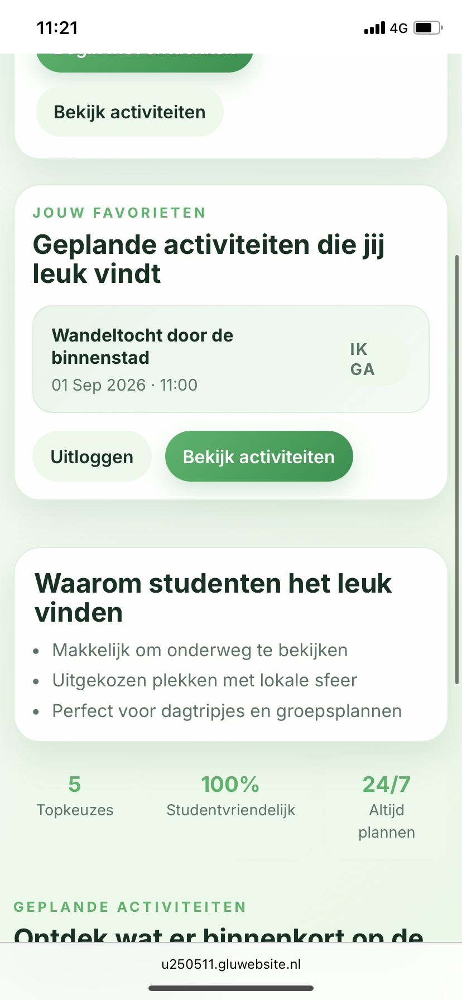
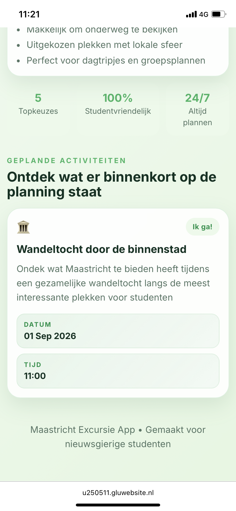
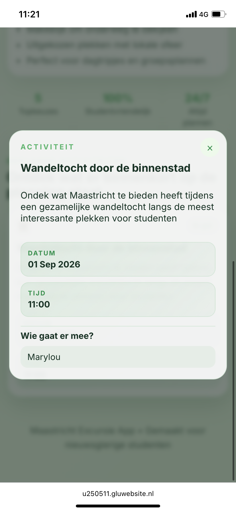

# Maastricht excursie app

Dit is een mobiele website voor de excursie naar Maastricht aan het begin van het tweede school jaar met de opleiding Creative Software Development.

Met deze app kunnen studenten kijken naar geplande activiteiten en aangeven of ze meegaan. Per activiteit kunnen gebruikers zien wie zich hebben aangemeld

## Screenshots
  

  
  
  

## Live URL

https://u250511.gluwebsite.nl/maastricht-excursie-app/
